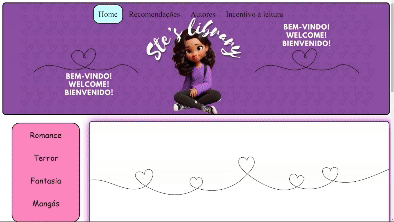

Este projeto tem como objetivo criar uma plataforma online que incentive a leitura, oferecendo aos leitores a oportunidade de ver avaliações de livros e recomendações de leitura. Além disso, a plataforma destaca biografias e histórias de vida de alguns autores.

Apresentarei agora todas as páginas que se encontram no site:

**Home**

Esta é a página inicial, onde você encontrará uma seleção diversificada de gêneros de livros, acompanhada de suas sinopses. Navegue por diferentes categorias e descubra novas leituras que atendem aos seus interesses.

  

**Recomendações**

Esta é a página de recomendações, onde você encontrará um carrossel interativo exibindo os livros recomendados pelo Bolt.

  

**Autores**

Esta é uma pagina onde fala um pouco da vida de alguns autores e suas obras.

  

**Autores**

Esta página tem como objetivo principal incentivar a leitura. Além disso, ela apresenta um gráfico que mostra as regiões do país com o maior número de leitores. Ao lado do gráfico, você encontrará um quiz sobre diversas histórias, proporcionando uma forma interativa e educativa de engajar os visitantes.

  

Na criação deste site, utilizei HTML, CSS e JavaScript para adicionar várias funcionalidades interativas. Aqui estão algumas das principais funcionalidades que implementei:

- Carrossel: Um carrossel de imagens que alterna automaticamente entre as imagens a cada 5 segundos. A função nextImage controla a navegação entre as imagens, garantindo que o carrossel seja cíclico.

- Navegação: Uma funcionalidade de navegação que permite alternar entre diferentes seções do site. A função Navegacao oculta e mostra as seções conforme a seleção do usuário, e atualiza a imagem associada à aba selecionada.

- Gráfico: Um gráfico de barras que exibe a porcentagem de leitores e não leitores por região do país, utilizando a biblioteca Chart.js.

- Quiz: Um quiz interativo que fornece feedback imediato sobre as respostas dos usuários. As funções Hiromu, Togashi, Oda, e outras são responsáveis por atualizar a resposta exibida com base nas opções selecionadas.

Essas funcionalidades proporcionam uma experiência interativa e dinâmica para os usuários do site, melhorando a navegação, visualização de dados e engajamento com quizzes.

Link abaixo para acessar o site:

<a href="https://694bc4b6-f737-4d8f-b56d-047ee08953fc-00-1jz948ry3ihbl.worf.replit.dev/" target="_blank" style="color: #1a73e8; text-decoration: none; font-weight: bold;">
  Site de livros
</a>
